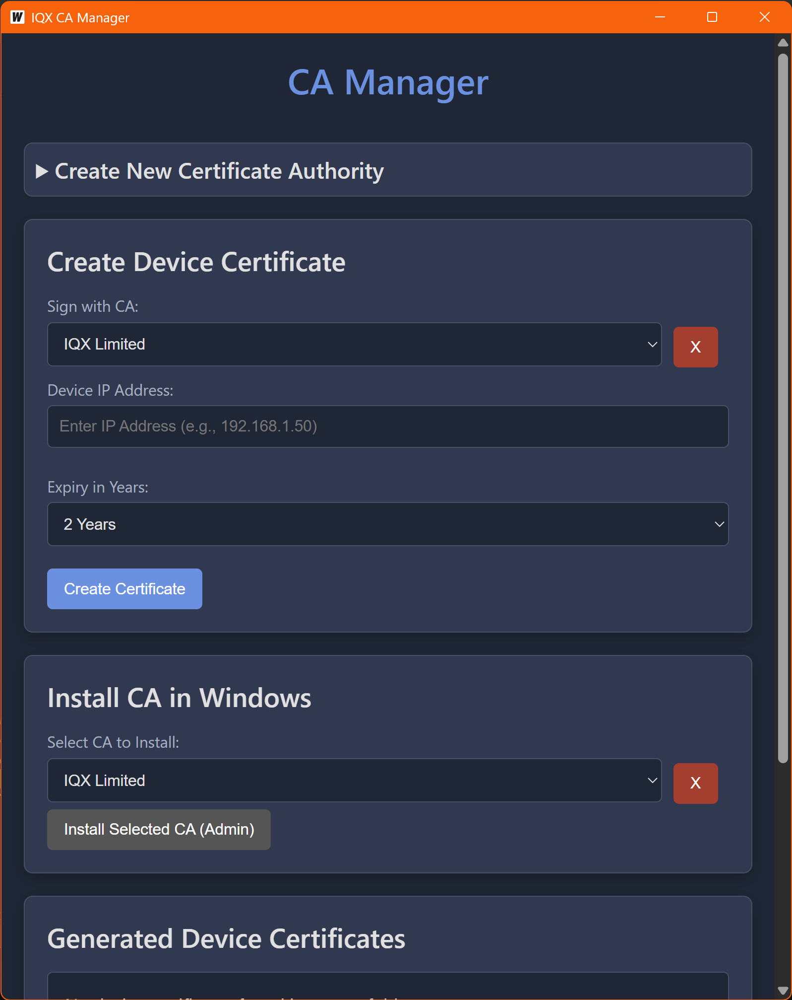

# IQX Certificate Authority Manager

A simple, cross-platform desktop application for creating and managing a local Certificate Authority (CA) and issuing device certificates. Built with Go and Wails, this tool is ideal for securing internal network services that use IP addresses instead of domain names.



## Features

* **Create Multiple CAs:** Generate unique Certificate Authorities with custom details and expiry dates.
* **Issue Device Certificates:** Create certificates for devices on your network (identified by IP address), signed by any of your CAs.
* **Custom Expiry:** Set custom validity periods (in years) for both CAs and device certificates.
* **Windows Integration:** Install any of your CAs directly into the Windows Trusted Root Certification Authorities store with a single click (requires administrator privileges).
* **Inspect & Manage:** View the details of any generated device certificate in a clean, readable format.
* **Easy Deletion:** Safely delete CAs and device certificates directly from the UI.
* **Standalone Executable:** Compiles to a single, dependency-free executable file for easy distribution.

## Prerequisites

To build this application from source, you will need the following installed on your system:

1. **Go:** Version 1.18 or newer. You can download it from [go.dev](https://go.dev/dl/).
2. **Wails CLI:** The command-line tool for Wails. Install it by running:

    ```bash
    go install [github.com/wailsapp/wails/v2/cmd/wails@latest](https://github.com/wailsapp/wails/v2/cmd/wails@latest)
    ```

3. **System Dependencies:** Wails may require additional system libraries (like a C compiler). Run `wails doctor` to check if your system is ready.

## Building from Source

1. Clone the repository:

    ```bash
    git clone [https://github.com/gareth-johnstone/ca-manager.git](https://github.com/gareth-johnstone/ca-manager.git)
    ```

2. Navigate into the project directory:

    ```bash
    cd ca-manager
    ```

3. Run the build command:

    ```bash
    wails build
    ```

4. The compiled executable (`IQX CA Manager.exe` on Windows) will be located in the `build/bin/` directory.

## Usage

1. Run the executable from the `build/bin/` directory.
2. All generated certificates and keys will be saved in an `output` folder created in the same directory as the executable.
3. To use the "Install CA in Windows" feature, you must right-click the executable and select **"Run as administrator"**.

## Branding & Copyright

© 2025 IQX Limited. All rights reserved.
